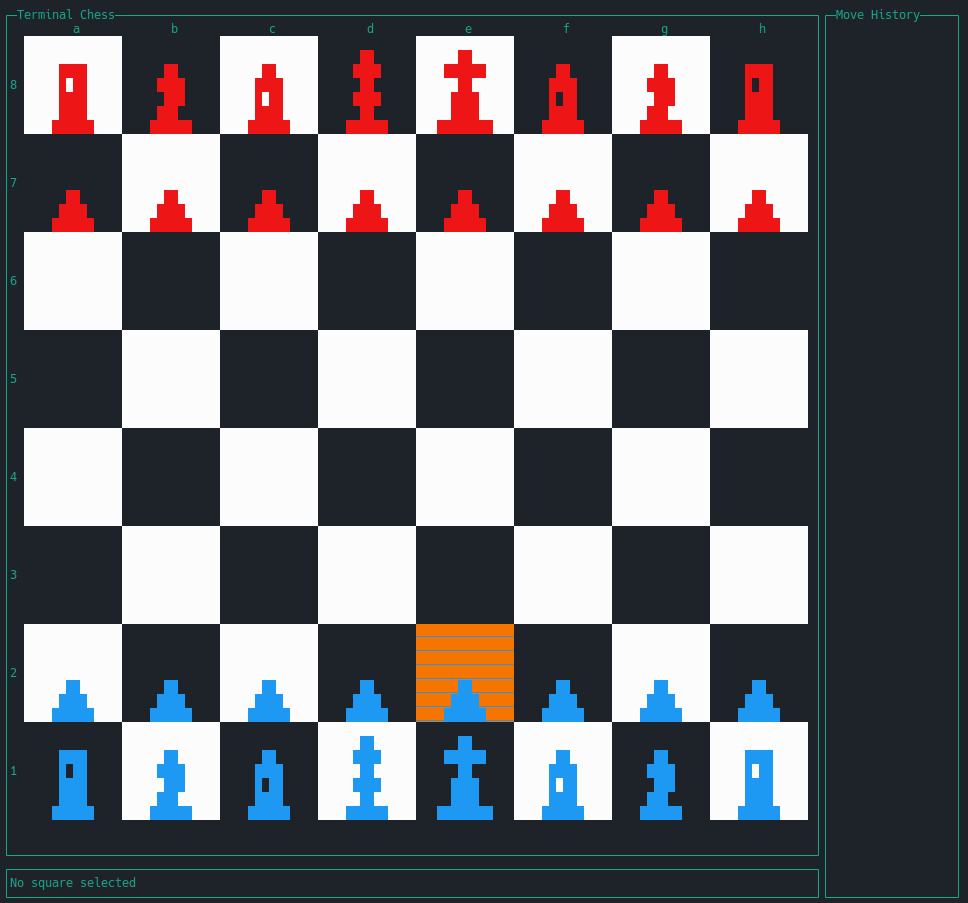

# TerminalChess

A simple chess UI in the terminal

## Navigation

The navigation is VIM based, so you can use the following keys to navigate:
- `h` - move left
- `j` - move down
- `k` - move up
- `l` - move right
- `q` - quit the game
- `r` - reset the game
- `s` - save the game
- `l` - load the game
- `p` - pick a piece

These defaults can be changed in the config.json file.

## Engine

The used default engine is Stockfish.
